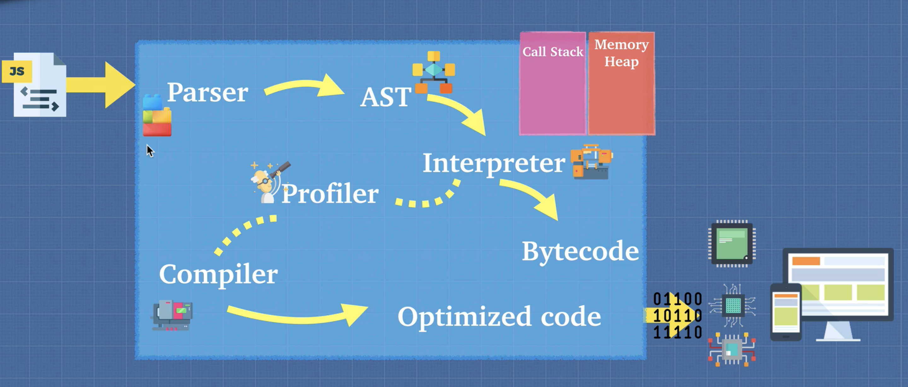

# Javascript Engine

## How does the computer read this?

The computer only understands 0 and 1. So if we have a computer with a CPU and a JavaScript file, the computer doesn't really know what to do with this javaScript file. We need a translater that allows the computer to understand the javascript code, and JavaScript Engine understands this javascript file and can tell the computer what to do.

## Is there only one JavaScript Engine ?

There are a ton of javascript engines such as `V8` and Spider Monkey which are called ECMAScript engines. These engines understand javascript files and it allows this engine to communicate and tell the machine, the computer to do what we ask it to do with JavaScript.

## Inside the JS Engine

 

