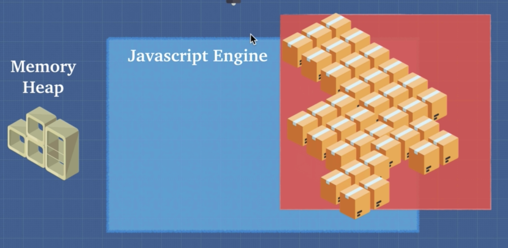
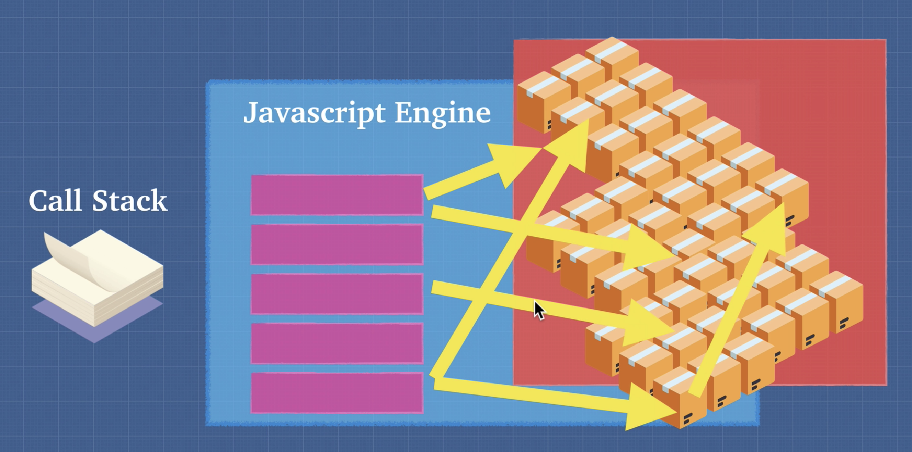

# Memory Heaps & Call Stack

In order to read out code and executing, we need a place to store & write information so that we can actually run and keep track of what's happening line by line on our code.

In JavaScript engine, there are two imporant things which makes us to do that.

First, the `memory heap` provides a place to `allocate memory`. It is simply a freestore, a large region in memory, that the JavaScript engine provides for us, which can be used to store any type of arbitrary data in an unordered fashion. There's no order to this memory.
It just allows us to use variables to point to different storage areas.

 

  

And Second, the `call stack` allows us to keep track of where our codes are so that we can run the code in order.

 

  

The `call stack` stores functions and variables as your code executes at each entry state of the stack, also called the stack frame, and these three stacks allows us to know where we are in the code.

It runs in a first-in last-out mode. That is the first-one-in is the last-one getting popped up.

We can keep adding to the stacks and eventually it pops all the function calls until we are done with our commands.

And we use the `memory heap` to actually point to different variables and objects and data that we store so that we know where to look.
The cool thing about call stack is that it allows JavaScript to know where it needs to be in the code.

## Stack Overflow

When maximum call stack size exceeded, it produces error and is going to print this stack trace, which is simply a snapshot of code execution at this stack frame.
