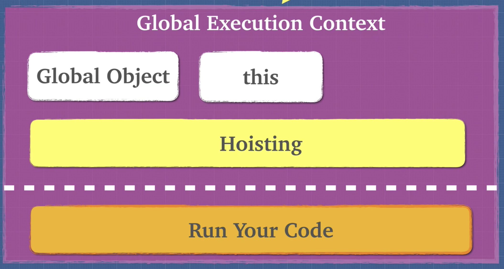

# Hoisting

**Hoisting is the behavior of moving the variables or function declarations to the top of their respective environments during the compilation phase. Variables are partially hoisted and function declarations are hoisted.**

 

 
 

In the creation phase, we know that the global execution is created and we set the global object and the 'this' keyword. And we have one more step called 'hoisting'. 
Next, we have the execution phase running our code.

`_NOTE_` Hoisting happens on every execution context. Any time when you run a function, a new execution context gets created and we have to go through the creation phase and execution phase again.

If JavaScript Engine sees either 'var' or 'function' keyword, it's going to hoist it and make space for it in memory before it executes it.

`Variables are partially hoisted`. We do not know the actual value yet, but since we know that variable is needed, the Javascript Engine assigns it as 'undefined' for later use.

On the other hand, `functions are fully hoisted`. It's almost like the function gets moved up to the top-line of the code and assigns a location and memory. 
There is a key distinction between function declaration and function expression when it comes to functions.

The Function expression is only going to be run after it was defined, so it's not a function.
