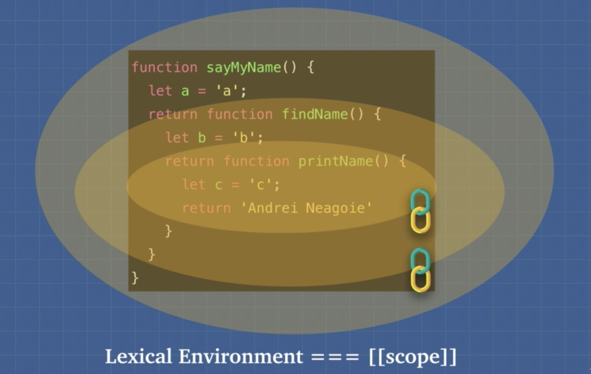
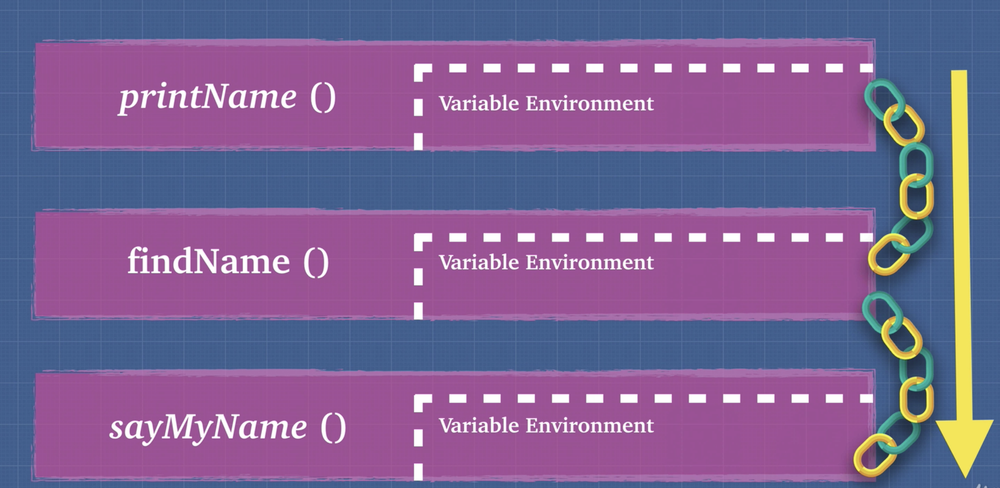
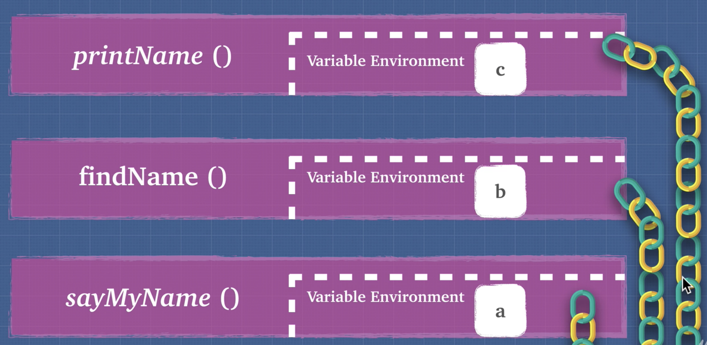

# Scope

Each execution context has a link to its outside world or a link to its parent, and this outer environment depends on where the function sits, lexically.

All functions have access to the global scope.

Let's look at the diagram below.

 

 
 

When a function is called, an environment is created for the new scope. Each lexical scope has its own variable environment, but also has another place that points to the outer scope which points to its outer scope until it hits the global scope.

## Reference

**Global Lexical Environment**
 

 

**Function Lexical Environment**
 

 
