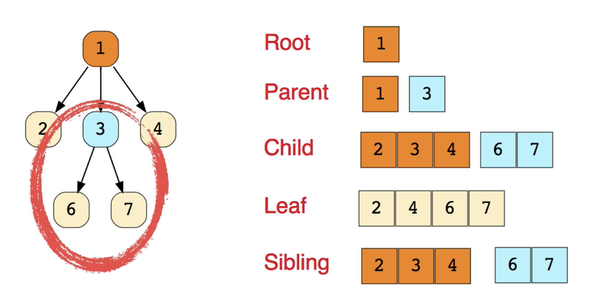

# Tree

Trees are a data structure that has a hierarchical structure, as opposed to linked lists or arrays, which are linear trees and can have zero or more child nodes.
A tree usually starts with a single 'root' node, and every child of the tree descends from this root node. And leaf nodes are the very end of a tree data structure.

 

 
 

The beauty of trees is that we use the same principle as we did in linked lists, that is we have nodes and these nodes can contain any type of information that we want.
However, a linked list has just one single path, and there's only one way to go from top to bottom, unlike the tree data structure.
