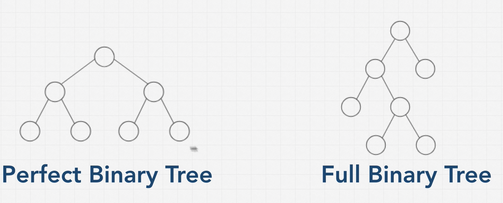

# Type 1. Binary Tree

A binary tree is a type of tree with a few rules that are applied to it.
Each node can only have either zero one or two nodes. and each child can only have one parent.

 

 
 

A perfect binary tree has everything filled in that means all the leaf nodes are full and there's no node that only has one child. A node either has zero children or two children. And also the bottom layer of the tree is completely filled.

A full binary tree, which simply says that a node has either a zero or two children, but never one child.

## why so important?

Because perfect binary tree, is really efficient and desirable. 
When binary trees are perfect like this, they have two really interesting properties.

1. One is that the number of total nodes on each level doubles as we move down the tree.
2. Second is that the number of nodes on the last level is equal to the sum of the number of nodes on all the other levels plus one.