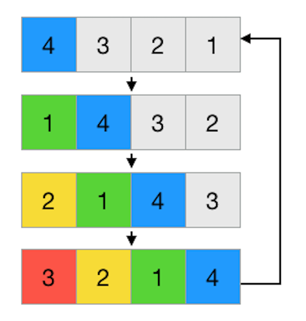

# Rotating Two Arrays

Rotating an array refers to shifting each of the given array's elements by one unit to the left and the last element to the beginning of the array.

</img>

Suppose that parameter arrA and arrB are given as two arrays. Please write a function `solution` that returns true if rotating arrA gives arrB, and false if it doesn't.

## Constraints

- arrA and arrB are arrays whose length is between 1 and 1,500.
  - The elements of both arrA and arrB are integers between 0 and 1,500.

## Examples

| arrA      | arrB      | return |
| --------- | --------- | ------ |
| [7,8,10]  | [8,10,7]  | true   |
| [4,7,2,9] | [2,9,4,8] | false  |

Example #1
When rotated twice, arrA becomes identical to arrB.

Example #2
No matter how many times arrA is rotated, it will never be identical to arrB.
