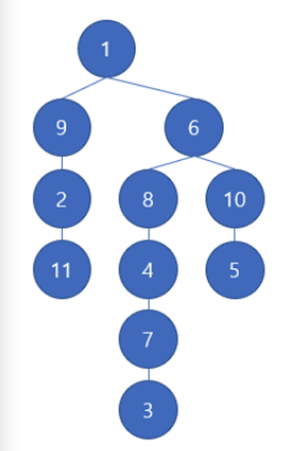

**11. Oil reservoir (Medium)**

**Rules**
There is an oil depot in a city. The oil is stored in a tree-shaped reservoir. Oil reservoirs numbered from 1 to N, and in certain vertex only two operations can be performed as follows.

```
1. Oil fills through that vertex. In this case, all oil reservoirs below the vertex are filled with oil.
2. Oil is extracted through the corresponding vertex. In this case, any oil in the reservoir above the vertex is also drained.
```

**Example**

</img>

If oil is filled through reservoir 6, reservoirs 8, 4, 7, 3, 10, and 5 will be filled with oil including reservoir 6 too. After that, if reservoir 4 is drained, all the oil in reservoir 6 and 8 above 4 will be drained.

Write a solution code for which checks if a particular oil reservoir is filled after certain operations are performed.

**Input Constraints:**

First row consists of "N Q".

```
-  1 <= N <= 10,000 (N is the number of reservoirs)
-  1 <= Q <= 10,000 (M is the number of operations)
```

Then, N-1 row will be given. The connection status of the oil reservoir is given in the form of 'a b', one per row.

This means that the two reservoirs are linked, and the top reservoir is always numbered 1. There is no case where the same connection state is duplicated. For example if 'a b' is given then 'b a' will not be shown.

After Q lines, one question per line is given as follows:

```
'1 a' : Fill oil through reservoir a.
'2 b' : Drain the oil through reservoir a.
'3 c' : Check whether reservoir 'c' is filled.
```

Whenever question 3 is asked, 1 is printed if oil is full, and 0 if not, one per line.

\*The first number indicates the type of operations, and there are only 3 types as shown above. the Second number is the number of reservoir (a,b,c).

```
Example 1
input = [
    "4 7",

    "3 4",
    "2 3",
    "2 1",

    "2 3",
    "3 1",
    "3 1",
    "3 3",
    "2 4",
    "3 4",
    "2 4",
]
output = [0,0,0,0]
```

```
Example 2
input = [
    "8 5",

    "8 1",
    "8 4",
    "5 6",
    "7 3",
    "2 5",
    "3 6",
    "4 6",

    "2 2",
    "3 2",
    "1 4",
    "3 7",
    "1 1",
]
output = [0,1]
```
