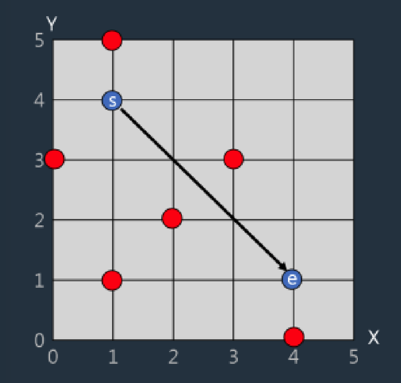
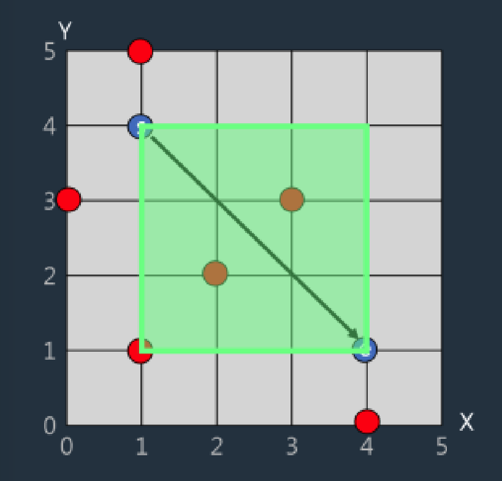
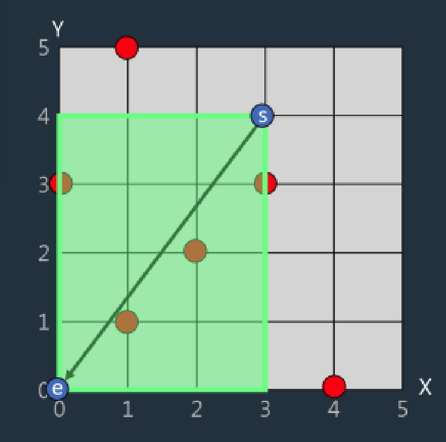

# Unit Finder

The following figure 1 shows how the units, controlled by the game player, are placed on a two-dimensional plane.

 

</img>

 

Each red dot represents the current unit's location. Players can select multiple units at once by designating a specific area.

Rhe blue dots indicate the starting point `s` and the ending point `e` of the area the player designates to select units.

At this time, let `s` and `e` be the opposite vertices, and each side is a rectangular region parallel to the x-axis and the y-axis.

 

</img>

For example, in the picture above, if the starting point `s` is located at (1,4), and the ending point `e` is located at (4,1), then the colored area becomes the area selected by the player, and there are three units within the colored area located at (1,1), (2,2), and (3,3) positions.

Complete the solution function which returns the number of units to be selected when the array, containing the current unit positions, and the starting position `s` and the ending position `e` are given as parameters.

## Constraints

- Location is an array which constains N positions and 1 <= N <= 10,000.
- Each element of the array indicates positions such as (xi, yi).
- 0 <= xi,yi <= 100,000 and both xi, yi are integers.
- No duplicates exist in the array.
- s and e cannot be equal position.

## Examples

| location                              | s     | e     | result |
| ------------------------------------- | ----- | ----- | ------ |
| [[0,3],[1,1],[1,5],[2,2],[3,3],[4,0]] | [1,4] | [4,1] | 3      |
| [[0,3],[1,1],[1,5],[2,2],[3,3],[4,0]] | [3,4] | [0,0] | 4      |

 

Example #1

Same as previous example.

Example #2

Four units at positions (0,3),(1,1),(2,2), (3,3) are selected as shown in the following figure.

</img>
