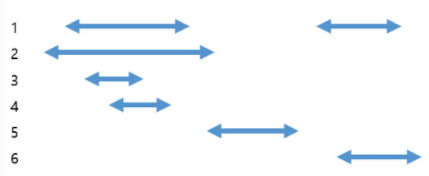

**11. Track Vistors (Meduium)**

In XXX company, building manager should keep a record of all visitor's entrance and/or exit time. When a particular person is judged to have the flu,
whoever was in close contact to that particular person within same period of time need to classified as potential flu patient.

For example, let's look at the following cases.



The start of the arrow, which points to the left, means the time when you enter the building and the end,which points to the right, means the time when you left the building.

If person number 1 is judged to have the flu, then number 2, 3, 5, and 6 should be classified as possible flu patient.

Your task is to determine the group of classified as possible flu patient.
If there is no possible flu patient, return -1.

**Input**

First argument is a string, and it contains the a number of visitors and number of visits separated with spaces. The

Second arugment represents the visitor history. negative sign mean the visitor with that number has left the building.

Last argument represents the person number who has been judged to have the flu.

**Constraints:**

```
-  5 <= N <= 100,000
-  1 <= M <= 300,000
- No one can enter the building at the same time one person leaves the building.
- No one has already entered the building.
```
